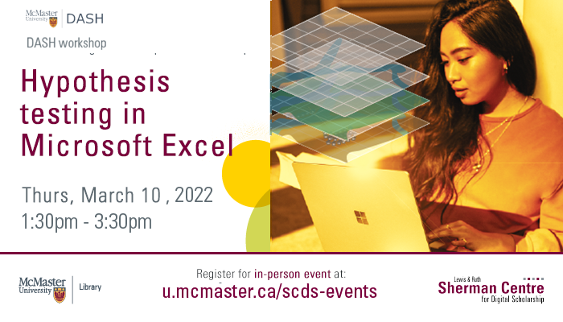

# Hypothesis Testing in Microsoft Excel

In this workshop, participants will learn to perform statistical analysis with the Data Analysis ToolPak in Excel. DASH Support Assistant Simran Kaur will guide attendees through installing the ToolPak and running programs including Z-test, T-test, Analysis of Variance, and the Chi-Square test. The session will also discuss how to run a linear regression model.

## Workshop Preparation 

Because this is an intermediate level workshop focused on learning how to run different hypothesis tests in Microsoft Excel, it is important to have prior basic knowledge of Excel as well as the hypothesis testing methods.

<!-- ## Facilitator Bio -->

<!-- Missing bio -->
