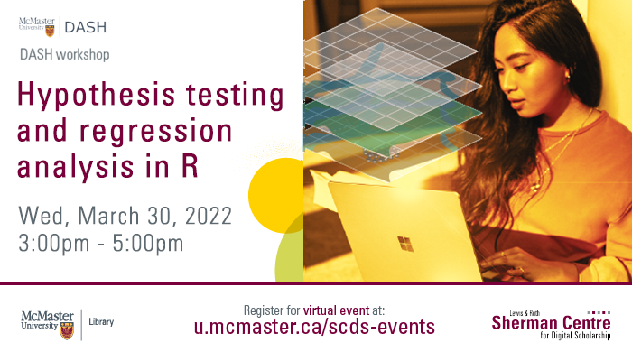

# Hypothesis Testing and Regression Analysis in R

In this workshop, participants will learn how to conduct hypothesis tests in R, along with correlation and regression analysis. The session will include t test, paired t test, ANOVA, regression, correlation, and covariance. The workshop is open to all who wish to learn about running data analysis in R, however, it is essential to have some prior basic knowledge of the software. This session will be interactive, so bring your laptops and follow along with the facilitator, DASH Support Assistant Simran Kaur. The DASH team looks forward to seeing you at the workshop!

<!-- ## Facilitator Bio -->

<!-- Missing bio -->

## Workshop Preparation 

Access the workshop files here:
- [crop.data.csv](../data/crop.data.csv)
- [Workshop3.R](../data/Workshop3.R)

An installation of [R](https://www.r-project.org/) and [RStudio](https://posit.co/downloads/) will also be needed.

## Workshop Recording

<iframe height="416" width="100%" allowfullscreen frameborder=0 src="https://echo360.ca/media/79e2ba7b-531d-4e4f-b788-cbb765197458/public"></iframe>
[View original here.](https://echo360.ca/media/79e2ba7b-531d-4e4f-b788-cbb765197458/public)
