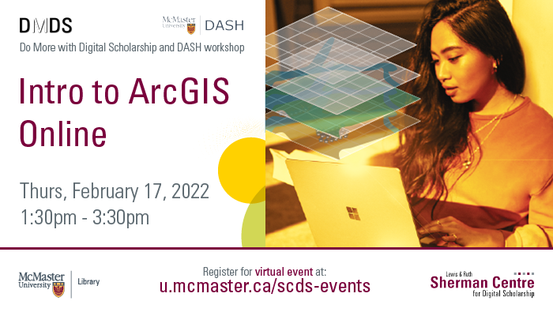

# Intro to ArcGIS Online

If you’ve ever thought that a map would help illustrate a critical part of your research, this workshop is for you. At this beginner-friendly session, Christine Homuth (Spatial Information Specialist) will introduce participants to the core concepts of Geographic Information Systems (GIS) and geospatial data, then show attendees how to apply these concepts during a hands-on exercise where the group will create a web-based map in ArcGIS Online. This session will be recorded and shared publicly. 

## Workshop Preparation 

Sign up for an ArcGIS Online account:
- Go to <https://www.arcgis.com/index.html>.
- Click “Sign In” > Create an account > Create an ArcGIS Public Account (or free trial).
- Complete the form and verify your account.

Current students, staff, and faculty may request an organizational account by contacting <mailto:libgis@mcmaster.ca>.

## Facilitator Bio

Christine Homuth (she/her) draws on her wide range of experiences to provide support for teaching and research to students, researchers, and faculty members working with Geographic Information Systems (GIS) and geospatial data. Some of her more recent work includes georeferencing historical maps and developing web map indexes as finding aids to make the Lloyd Reeds Map Collection’s resources more readily accessible.

## Workshop Slides

<embed src="assets/docs/Intro_ArcGISOnline_Slides.pdf" style="border:none;" width="100%" height="466px">

[Download as PDF.](assets/docs/Intro_ArcGISOnline_Slides.pdf)

## Workshop Worksheet

<embed src="assets/docs/Intro_ArcGISOnline_Exercise.pdf" style="border:none;" width="100%" height="466px">

[Download as PDF.](assets/docs/Intro_ArcGISOnline_Exercise.pdf)

## Additional Resources
- [Learn ArcGIS](https://learn-arcgis-learngis.hub.arcgis.com/)
- [ArcGIS Online documentation](https://www.esri.com/en-us/arcgis/products/arcgis-online/resources)
- [Data Analysis Support Hub (DASH)](https://library.mcmaster.ca/services/dash#tab-dash-resources)
- [Open Hamilton](https://open.hamilton.ca/)