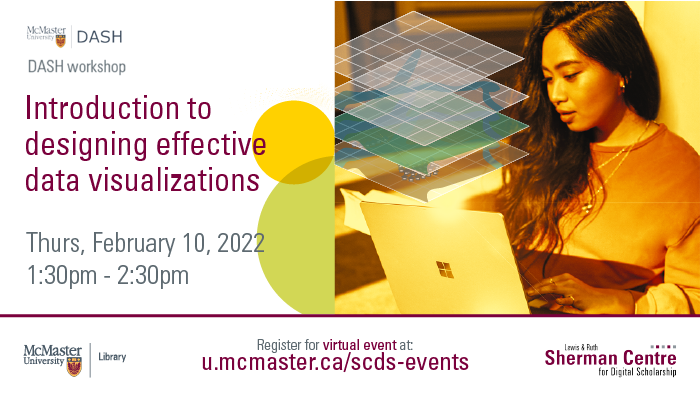

# Intro to Designing Effective Data Visualizations

An effective data visualization makes all the difference. Learn to present your research in its best light at this beginner-friendly workshop on the basic design principles and best practices that can be applied across different data visualization software and tools. Subhanya Sivajothy (Data Analysis and Visualization Librarian) will teach participants how to plan for visualizations from concept to design output, and how to incorporate thinking about dissemination of data as scholars progress in their research. This session will be recorded and shared publicly. 

## Facilitator Bio

Subhanya Sivajothy (she/her) brings a background of research in data justice, science and technology studies, and environmental humanities. She is currently thinking through participatory data design which allow for visualizations that are empowering for the end user. She also has experience in Research Data Management—particularly data cleaning and curation. Do not hesitate to reach out to her if you would like to talk more about data analysis and visualization as they evolve throughout the research process.

## Workshop Recording

<iframe height="416" width="100%" allowfullscreen frameborder=0 src="https://echo360.ca/media/06bf0b7e-525f-4385-9a3e-2bb287419b34/public"></iframe>
[View original here.](https://echo360.ca/media/06bf0b7e-525f-4385-9a3e-2bb287419b34/public)
