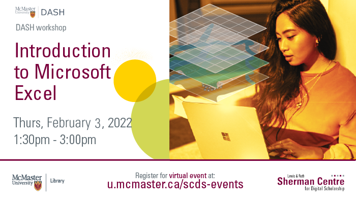

# Introduction to Microsoft Excel

This introductory workshop will introduce participants to the basic layout of Microsoft Excel and teach them how to navigate the software. DASH Support Assistant Simran Kaur will show participants how to enter data, overview functions and formulas, and teach the group to format cells, insert new rows, and create charts and graphs. This will be an interactive workshop, so please bring your laptop and get ready for a hands-on learning experience. No prior experience with Excel required. This session will be recorded and shared publicly. 

<!-- ## Facilitator Bio -->

<!-- Missing bio -->

## Workshop Recording

<iframe height="416" width="100%" allowfullscreen frameborder=0 src="https://echo360.ca/media/b6879ba7-5e11-4559-9f2c-3b7a62d42bdd/public"></iframe>
[View original here.](https://echo360.ca/media/b6879ba7-5e11-4559-9f2c-3b7a62d42bdd/public)
