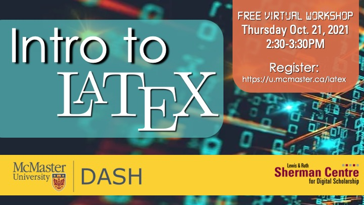

# Intro to LaTeX

This workshop will introduce you to LaTeX, a typesetting system commonly used in STEM disciplines to create high-quality documents and easily write mathematical equations. We will discuss tools for writing in LaTeX, the structural elements of LaTeX, text formatting, and commands for writing mathematical equations. You will learn the commands to create your first LaTeX document. This session will be recorded and made available openly.

**The recording and materials for this workshop are available here:** <https://learn.scds.ca/intro-latex/>

## Facilitator Bio

John Fink’s (he/they) talents lie in complex and innovative systems administration and project management. He also has an interest in the maker/hacker element in digital scholarship, and is frequently spotted tinkering with esoteric hardware. If you are interested in having the Sherman Centre support your project, John is an excellent first contact.

Katie Harding works with the Faculty of Engineering to help engineering students learn how to understand, find, read, interpret, and create different types of information sources. She has spent the last decade teaching and providing research support to students and researchers in science and engineering. Her recent projects have focused on the development of some exciting new open educational resources.