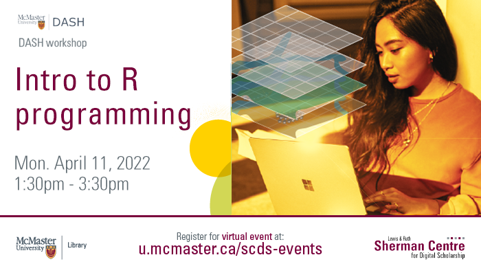

# Intro to R Programming

R has a powerful suite of high-level statistical functions, but sometimes you need lower-level control over the functionality of your script. In this workshop, you will learn how to write programs in R using functions and control flow. We will cover functions, conditional blocks, loops, and debugging.

**The recording and materials for this workshop are available here:** <https://learn.scds.ca/intro-r/>

<!-- ## Facilitator Bio -->

<!-- Missing bio -->
