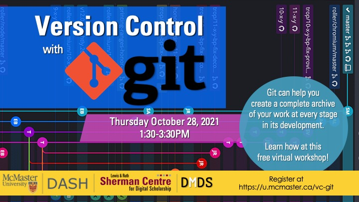

# Version Control with Git

This workshop will give you a solid introduction to Git. Git is software originally designed to help manage vast, decentralized software projects with hundreds of authors, but it works just as well with many things that aren’t software, like data and text. Imagine having a complete archive of your work at every stage in its development! This workshop assumes no prior experience. This session will be recorded and made available openly.

**The recording and materials for this workshop are available here:** <https://learn.scds.ca/intro-git/>

## Facilitator Bio

John Fink’s (he/they) talents lie in complex and innovative systems administration and project management. He also has an interest in the maker/hacker element in digital scholarship, and is frequently spotted tinkering with esoteric hardware. If you are interested in having the Sherman Centre support your project, John is an excellent first contact.